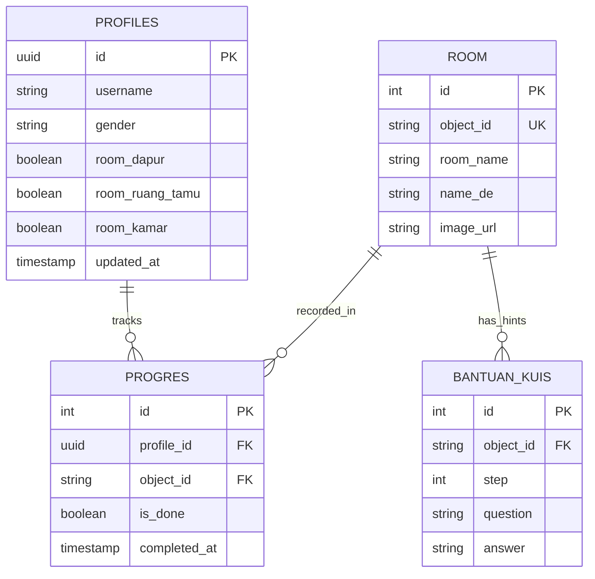

# 🇩🇪 GEILE WORTE — Deutsch Vokabelspiel

<div align="center">


<p align="center">
  <strong>Game Edukasi Interaktif Berbasis Web untuk Belajar Kosakata Bahasa Jerman (Vokabeln & Nomen mit Artikeln: <i>der, die, das</i>)</strong>
</p>

[Fitur Utama](#-fitur-utama) •
[Demo & Ruangan](#-pilihan-ruangan--gameplay) •
[Tech Stack](#-tech-stack) •
[Struktur Database](#-struktur-database-supabase) •
[Struktur Folder](#-struktur-folder-proyek) •
[Panduan Instalasi](#-panduan-instalasi--menjalankan-proyek) •
[Keamanan & Git](#-keamanan--konfigurasi-gitignore)

</div>

---

## 📖 Tentang Aplikasi

**GEILE WORTE** adalah aplikasi game web edukasi interaktif yang dirancang untuk mempermudah anak-anak maupun pembelajar pemula dalam menghafal dan memahami kosakata bahasa Jerman beserta artikel gramatikanya (**der**, **die**, **das**). 

Melalui metode gamifikasi eksplorasi visual, pemain diajak menelusuri berbagai ruangan rumah (Dapur, Ruang Tamu, dan Kamar Tidur), mengidentifikasi objek tersembunyi berformat interaktif SVG, dan menjawab kuis tebak kata dengan petunjuk bertingkat serta efek suara yang menyenangkan.

---

## ✨ Fitur Utama

- 🏠 **Interactive Room Exploration (Eksplorasi Ruangan Dinamis):**
  Pemain dapat memilih ruangan dan mengeklik objek interaktif langsung pada ilustrasi ruangan berformat SVG yang responsif. Objek yang berhasil ditebak akan berubah warna dari hitam-putih (*grayscale*) menjadi berwarna penuh (*colored*).

- 🧩 **Smart Quiz & Input Validasi:**
  Tantangan menebak nama benda lengkap beserta artikel Jerman yang tepat (*der / die / das*), dilengkapi dengan normalisasi teks (case-insensitive & toleransi spasi).

- 💡 **Sistem Bantuan Bertingkat (*bantuan_kuis*):**
  Ketika pemain kesulitan menebak nama benda, tersedia tombol bantuan berupa pertanyaan bertahap (*multi-step hint*) untuk memandu pemain menemukan jawaban yang tepat.

- 🔐 **Autentikasi & Profil Pengguna (Supabase Auth):**
  - Registrasi & Login dengan email, password, username, dan pilihan gender avatar.
  - Sesi login tersimpan secara persisten (*session persistence*).
  - Modal konfirmasi logout yang aman.

- 🏆 **Pelacakan Progres Real-Time:**
  Setiap progres tebakan objek dan status penyelesaian ruangan disimpan otomatis ke tabel database Supabase (`profiles` & `progres`).

- 🎵 **Sistem Audio Lengkap (BGM & SFX):**
  - Musik latar ceria (*background music*) yang dapat diaktifkan/dinonaktifkan (*sound toggle*).
  - Efek suara interaktif (*mouse-click*, suara jawaban benar, dan suara jawaban salah).
  - Kontrol volume terpisah untuk BGM (*Music*) dan SFX (*Sound Effects*).

- 📖 **Tutorial Interaktif:**
  Panduan visual langkah-demi-langkah bagi pemain baru agar mudah memahami alur permainan sejak awal masuk.

- 🎨 **Desain Playful & Modern:**
  Tampilan bergaya ceria (*kid-friendly*) dengan tipografi kustom **Fredoka**, animasi mikro yang halus, serta notifikasi *toast* yang responsif.

---

## 🛋️ Pilihan Ruangan & Gameplay

| Ruangan | Nama Jerman | Deskripsi Pembelajaran |
| :--- | :--- | :--- |
| **Dapur** | *Die Küche* | Mengenal peralatan masak, kulkas (*der Kühlschrank*), blender, meja makan, dan perabot dapur lainnya. |
| **Ruang Tamu** | *Das Wohnzimmer* | Menjelajahi sofa (*das Sofa*), televisi (*der Fernseher*), lampu meja, jam dinding, karpet, dll. |
| **Kamar Tidur** | *Das Schlafzimmer* | Menemukan ranjang/tempat tidur (*das Bett*), lemari pakaian, lampu gantung, meja belajar, dll. |

---

## 🛠️ Tech Stack

- **Framework:** [Next.js 16 (App Router)](https://nextjs.org/)
- **Library UI:** [React 19](https://react.dev/)
- **Styling:** [Tailwind CSS v4](https://tailwindcss.com/) & Vanilla CSS (`Fredoka` Google Fonts)
- **Backend as a Service:** [Supabase](https://supabase.com/)
  - Supabase Authentication (User Management & Metadata)
  - Supabase PostgreSQL (Penyimpanan data profil, objek ruangan, bantuan kuis, dan progres)
- **Audio & Media:** HTML5 Audio API & Scalable Vector Graphics (SVG Polygon Mapping)

---

## 🗄️ Struktur Database (Supabase)

Proyek ini terhubung ke Supabase dengan tabel-tabel utama berikut:



---

## 📁 Struktur Folder Proyek

```plaintext
game-bahasa-jerman/
├── public/
│   ├── assets/
│   │   ├── font/                 # Font lokal & tipografi
│   │   ├── image-fix/            # Ilustrasi utama SVG dan PNG (Dapur, Ruang Tamu, Kamar)
│   │   ├── image-2/              # Aset gambar per-objek (Colored & Grayscale/BW)
│   │   └── sound/                # File audio (BGM ceria, klik SFX, benar/salah SFX)
│   └── favicon & icons
├── src/
│   ├── app/
│   │   ├── globals.css           # Konfigurasi Tailwind CSS v4 & styling global
│   │   ├── layout.js             # Root layout & inisialisasi font Fredoka
│   │   └── page.js               # State manager utama (Auth, Routing, BGM Provider)
│   ├── components/
│   │   ├── AuthScreen.js         # Halaman Sign In / Sign Up
│   │   ├── MainMenuScreen.js     # Menu utama (Start Game, Pengaturan, Profil)
│   │   ├── RoomSelectionScreen.js# Pemilihan ruangan, status gembok/terbuka & tutorial
│   │   ├── KitchenQuizScreen.js  # Gameplay kuis ruangan dapur
│   │   ├── LivingRoomQuizScreen.js# Gameplay kuis ruangan ruang tamu
│   │   ├── BedroomQuizScreen.js  # Gameplay kuis ruangan kamar tidur
│   │   ├── LoadingScreen.js      # Animasi loading saat verifikasi sesi auth
│   │   ├── LogoutConfirmModal.js # Modal konfirmasi keluar akun
│   │   └── Toast.js              # Komponen alert notifikasi feedback pemain
│   └── utils/
│       └── supabaseClient.js     # Inisialisasi client Supabase
├── .env.example                  # Template variabel lingkungan publik
├── .gitignore                    # Aturan keamanan file Git yang telah dioptimasi
├── package.json                  # Metadata dependensi & skrip proyek
└── README.md                     # Dokumentasi proyek
```

---

## 🚀 Panduan Instalasi & Menjalankan Proyek

### 1. Prasyarat
- Pastikan Anda telah menginstal **Node.js** (versi 18.18+ atau versi 20+ disarankan)
- Memiliki akun aktif di **[Supabase](https://supabase.com)**

### 2. Kloning Repositori
```bash
git clone https://github.com/username/game-bahasa-jerman.git
cd game-bahasa-jerman
```

### 3. Pasang Dependensi
```bash
npm install
# atau
yarn install
# atau
pnpm install
```

### 4. Konfigurasi Variabel Lingkungan (*Environment Variables*)
Salin file `.env.example` menjadi `.env.local`:
```bash
cp .env.example .env.local
```

Buka file `.env.local` dan isi dengan kredensial proyek Supabase Anda:
```env
NEXT_PUBLIC_SUPABASE_URL=https://your-project-ref.supabase.co
NEXT_PUBLIC_SUPABASE_ANON_KEY=your-anon-public-key-here
```

### 5. Jalankan Server Pengembangan (*Development Server*)
```bash
npm run dev
```

Buka peramban web (*browser*) Anda dan akses:
👉 **[http://localhost:3000](http://localhost:3000)**

### 6. Build untuk Produksi
```bash
npm run build
npm run start
```

---

## 🔒 Keamanan & Konfigurasi .gitignore

File [`.gitignore`](file:///.gitignore) telah diaudit dan diperkuat dengan standar keamanan terbaik:

- ✅ **Variabel Lingkungan Aman:** Semua file `.env*` diabaikan otomatis sehingga kunci privat tidak akan bocor ke GitHub. File [`.env.example`](file:///.env.example) tetap dipertahankan sebagai acuan bagi developer lain.
- ✅ **Pencegahan Bloat Repositori:** File rekaman layar / video demo (`*.mp4`, `*.mov`, `*.webm`) yang berukuran besar (>56 MB) otomatis diabaikan agar ukuran repositori Git tetap ringan dan cepat di-clone.
- ✅ **Pembersihan File Uji/Scratch:** Skrip uji coba lokal (`check-*.js`, `extract.js`, `temp_*`) tidak ikut ter-commit ke repositori utama.
- ✅ **Pembersihan Metadata OS & IDE:** File cache dari Windows (`Thumbs.db`, `Desktop.ini`), macOS (`.DS_Store`), dan editor (`.vscode/`, `.idea/`) terlindungi dari ketidaksengajaan commit.